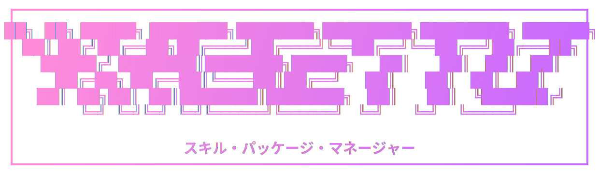

<p align="center">
  
</p>

<p align="center">
  
  
  
</p>

- [Overview](#overview)
- [Alternatives and why Kasetto](#alternatives-and-why-kasetto)
  - [Compared to Vercel Skills](#compared-to-vercel-skills)
  - [Compared to Claude Plugins](#compared-to-claude-plugins)
- [Features](#features)
- [Install](#install)
- [Quick Start](#quick-start)
- [Remote Config over HTTPS](#remote-config-over-https)
- [Commands](#commands)
  - [`sync`](#sync)
  - [`list`](#list)
  - [`doctor`](#doctor)
- [Supported Agents](#supported-agents)
- [Configuration](#configuration)
- [Storage Model](#storage-model)
- [Common Workflows](#common-workflows)
  - [Team bootstrap from remote config](#team-bootstrap-from-remote-config)
  - [Local experimental pack](#local-experimental-pack)
  - [Multi-source curated stack](#multi-source-curated-stack)
- [License](#license)

## Overview

`kasetto` is a fast CLI skill package manager for AI coding agents.

It syncs skill sets from repositories into local agent skill folders, tracks state in a local manifest DB, and provides diagnostics via `doctor`.

`Kasetto` comes from the Japanese word **カセット** (*kasetto*), which means **cassette**.

The idea is the same as old music players: you can prepare a bundle, swap bundles quickly, and keep your collection organized.

With Kasetto, each skill source is like a cassette you can insert, sync, and update. Skills stay easy to package, move, and reproduce.

## Alternatives and why Kasetto

There are great alternatives, including:
- [Vercel Skills](https://github.com/vercel-labs/skills)
- [Claude Plugins](https://claude.com/plugins)

Kasetto is a better fit when you need **deterministic, repo-driven skill bundle management** across environments.

### Compared to Vercel Skills

Vercel Skills gives a strong curated catalog and easy install flow.
Kasetto is better when you need:
- multi-source sync in one config
- reproducible team bootstrap from a versioned YAML file
- stateful install tracking (`~/.kst/manifest.db`) and diagnostics (`doctor`)
- destination targeting across many agent environments with one preset field

### Compared to Claude Plugins

Claude Plugins are excellent for in-product integrations and runtime capabilities inside Claude.
Kasetto is better when you need:
- agent-agnostic skill bundle distribution from Git/local sources
- repository-native workflow (no plugin marketplace dependency)
- predictable sync/update/remove lifecycle with dry-run support
- CLI-first ops that can be scripted in CI or bootstrap scripts

## Features

- Fast sync/install/update/remove workflow for skills
- Config-driven setup with local file or remote URL config
- Destination presets for a broad set of supported agent CLIs
- Interactive `list` browser (arrow keys + vim keys)
- Manifest-backed state (`~/.kst/manifest.db`) with run reports
- `doctor` diagnostics for version, paths, last sync, and failed skills
- Styled output and `--json` modes for automation
- Alias binary: `kst` (same behavior as `kasetto`)

## Install

TBA

## Quick Start

1. Create config file:
```yaml
agent: codex
skills:
  - source: https://github.com/pivoshenko/pivoshenko.ai
    skills:
      - name: pivoshenko-brand-guidelines
      - name: skill-creator
```

2. Sync skills:
```bash
kasetto sync --config skills.config.yaml
```

Or use a remote config directly over HTTPS:
```bash
kasetto sync --config https://example.com/skills.config.yaml
```

3. Browse installed skills:
```bash
kasetto list
```

4. Run diagnostics:
```bash
kasetto doctor
```

## Remote Config over HTTPS

You can run Kasetto without a local config file by passing an HTTPS URL:

```bash
kasetto sync --config https://example.com/skills.config.yaml
```

This is useful when:
- sharing one canonical config across a team
- bootstrapping new machines quickly
- pinning startup flow to a centrally managed config

## Commands

### `sync`
Sync configured skills into destination directory.

```bash
kasetto sync [--config <path-or-url>] [--dry-run] [--quiet] [--json] [--plain] [--verbose]
```

Notes:
- `--config` supports local path or HTTP(S) URL
- `--dry-run` previews changes without writing
- Missing skills are reported as broken (non-fatal)
- Exit code is non-zero only for source-level failures

### `list`
List installed skills from manifest DB.

```bash
kasetto list [--json]
```

Notes:
- TTY: interactive browser UI
- Non-TTY: plain list output
- `NO_TUI=1` disables interactive mode

### `doctor`
Show local diagnostics.

```bash
kasetto doctor [--json]
```

Includes:
- Version
- Manifest DB path
- Installation path
- Last sync timestamp
- Failed skills from latest sync report

## Supported Agents

When you set `agent`, Kasetto resolves destination to that agent's global skill folder.

| Agent          | `agent:` value   | Path                            |
| -------------- | ---------------- | ------------------------------- |
| Amp            | `amp`            | `~/.config/agents/skills/`      |
| Kimi Code CLI  | `kimi-cli`       | `~/.config/agents/skills/`      |
| Replit         | `replit`         | `~/.config/agents/skills/`      |
| Universal      | `universal`      | `~/.config/agents/skills/`      |
| Antigravity    | `antigravity`    | `~/.gemini/antigravity/skills/` |
| Augment        | `augment`        | `~/.augment/skills/`            |
| Claude Code    | `claude-code`    | `~/.claude/skills/`             |
| OpenClaw       | `openclaw`       | `~/.openclaw/skills/`           |
| Cline          | `cline`          | `~/.agents/skills/`             |
| Warp           | `warp`           | `~/.agents/skills/`             |
| CodeBuddy      | `codebuddy`      | `~/.codebuddy/skills/`          |
| Codex          | `codex`          | `~/.codex/skills/`              |
| Command Code   | `command-code`   | `~/.commandcode/skills/`        |
| Continue       | `continue`       | `~/.continue/skills/`           |
| Cortex Code    | `cortex`         | `~/.snowflake/cortex/skills/`   |
| Crush          | `crush`          | `~/.config/crush/skills/`       |
| Cursor         | `cursor`         | `~/.cursor/skills/`             |
| Deep Agents    | `deepagents`     | `~/.deepagents/agent/skills/`   |
| Droid          | `droid`          | `~/.factory/skills/`            |
| Gemini CLI     | `gemini-cli`     | `~/.gemini/skills/`             |
| GitHub Copilot | `github-copilot` | `~/.copilot/skills/`            |
| Goose          | `goose`          | `~/.config/goose/skills/`       |
| Junie          | `junie`          | `~/.junie/skills/`              |
| iFlow CLI      | `iflow-cli`      | `~/.iflow/skills/`              |
| Kilo Code      | `kilo`           | `~/.kilocode/skills/`           |
| Kiro CLI       | `kiro-cli`       | `~/.kiro/skills/`               |
| Kode           | `kode`           | `~/.kode/skills/`               |
| MCPJam         | `mcpjam`         | `~/.mcpjam/skills/`             |
| Mistral Vibe   | `mistral-vibe`   | `~/.vibe/skills/`               |
| Mux            | `mux`            | `~/.mux/skills/`                |
| OpenCode       | `opencode`       | `~/.config/opencode/skills/`    |
| OpenHands      | `openhands`      | `~/.openhands/skills/`          |
| Pi             | `pi`             | `~/.pi/agent/skills/`           |
| Qoder          | `qoder`          | `~/.qoder/skills/`              |
| Qwen Code      | `qwen-code`      | `~/.qwen/skills/`               |
| Roo Code       | `roo`            | `~/.roo/skills/`                |
| Trae           | `trae`           | `~/.trae/skills/`               |
| Trae CN        | `trae-cn`        | `~/.trae-cn/skills/`            |
| Windsurf       | `windsurf`       | `~/.codeium/windsurf/skills/`   |
| Zencoder       | `zencoder`       | `~/.zencoder/skills/`           |
| Neovate        | `neovate`        | `~/.neovate/skills/`            |
| Pochi          | `pochi`          | `~/.pochi/skills/`              |
| AdaL           | `adal`           | `~/.adal/skills/`               |

Legacy compatibility note: `claude` is still accepted as an alias for `claude-code`.

When you set `destination`, it overrides `agent` and uses your explicit path.

## Configuration

Configuration can be provided either:
- as a local file path
- as an HTTPS URL via `--config`

Top-level keys:
- `agent` (optional): supported agent preset from the table above
- `destination` (optional): custom path (takes precedence over `agent`)
- `skills` (required): list of skill sources

Source entry:
- `source` (required): local path or GitHub URL
- `branch` (optional): branch for remote source (default: `main`, fallback `master`)
- `skills` (required):
  - `"*"` to sync all discovered skills
  - list of names: `- my-skill`
  - list objects: `- name: my-skill` with optional `path` override

Example with mixed sources:
```yaml
agent: codex

skills:
  - source: https://github.com/openai/skills
    branch: main
    skills:
      - code-reviewer
      - name: design-system

  - source: ~/Development/my-skills
    skills: "*"

  - source: https://github.com/acme/skill-pack
    skills:
      - name: custom-skill
        path: tools/skills
```

## Storage Model

Kasetto stores state in SQLite:
- DB file: `~/.kst/manifest.db`
- Tables:
  - `skills`: installed skill state (hash, source, destination, updated_at)
  - `meta`: general metadata (`last_run`)
  - `reports`: JSON sync reports per run

This enables:
- Change detection via hashes
- Incremental persistence
- Diagnostics over latest run results

## Common Workflows

### Team bootstrap from remote config

```bash
kasetto sync --config https://example.com/skills.config.yaml
```

Use this when one central config should drive setup for every new machine.

### Local experimental pack

```yaml
skills:
  - source: ~/Development/my-skills
    skills: "*"
```

Use this when you are iterating quickly on private or draft skills.

### Multi-source curated stack

```yaml
agent: codex
skills:
  - source: https://github.com/pivoshenko/pivoshenko.ai
    skills:
      - pivoshenko-brand-guidelines
  - source: https://github.com/vercel-labs/skills
    skills:
      - frontend-design
```

Use this when you want a single reproducible bundle from different sources.

## License

Licensed under either [MIT](LICENSE-MIT) or [Apache-2.0](LICENSE-APACHE), at your option.
